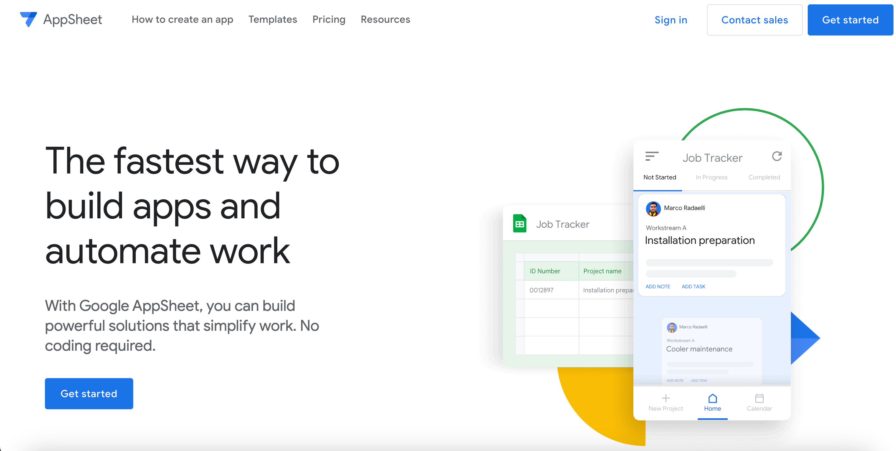

  <!-- 記事タイトル -->
  <h1 className="title-text">【AppSheet】 もう僕は迷わない in 秋葉原</h1>

  

  

      <!-- 下の画像URLを自分のアイコン画像にすること -->
      
    

      <!-- 自分の名前 -->
      Genki
      <!-- ひとことコメント(Twitterのbioみたいな) -->
      メイドカフェの入口で至極緊張するひよっこ🐣
    

  

<!-- 以下本文 -->
## 1. はじめに
こんにちは。Genkiと申します。 
海外の人が知ってそうな日本語といえば...？で真っ先に「元気」が浮かんだので、どこでも名乗りやすくて名乗ってます✌️　　

### 🐤 この記事でやること

ノーコードツールの**AppSheet**を使って、**私が行きたい秋葉原のメイドカフェを紹介するマップ付きアプリ**を作成します。

### 🐤 なんでやるの

秋葉原のメイドカフェ、**合計すると100軒以上あると言われています**コンセプトカフェ含む / 2023年5月時点

まさに百花繚乱の様相を呈しており…探すときに混乱するのです >< 

なのでワタシの気になる店舗だけでも一目でチェックできるようにしたいんです！

## 2. やっていくよ！

では早速始めていきます〜！

全体の流れとしては下記の通りになります。

1. データソース（メイドカフェ一覧）を準備する
2. AppSheetにログインする
3. データソースを選択し、アプリを作成する
4. データの並びや型、アプリのUIを整理する
5. スマホ（iPhone）で動作確認する

その前に...

### 🐤 そもそもAppSheetとはなんぞや

**AppSheetは、コードを書くことなく独自のアプリを作成できるプラットフォームです。**スプレッドシートやデータベースをデータソースとして活用することができ、GUIでアプリの動作や外観を設定することができます！（楽ちんでうれしい^^）

ビジネスの自動化・効率化に使われることが多いようですが、その容易さゆえ個人が趣味的にアプリを作りたいときにも大いに役に立つと思っています。

では、アプリを作っていきましょう！

 

### 🐤 データソースの準備

ぶっちゃけ作業全体の7割くらいはここに割かれました..笑

今回はお試しなので、Google SpreadSheetに手作業で入力しましたが、Webスクレイピング等用いて自動化したら楽かもしれないですね。

各店舗ごとに、**「No.」「店舗名」「住所」「写真」**の項目を用意しました。

### 🐤 AppSheetにログイン

では次に、AppSheetにログインします。
と言っても、データソースのSpread Sheetを用意したGoogleのアカウントと連携するだけです！

まずはこちらのサイトにアクセスします: https://www.appsheet.com/

右上の`[Get Started]`をクリック → Sing in With:で`[Google]`を選択し、ログインします。

ログインが完了すると、下記のようなホーム画面が表示されます。

### 🐤 データソースを選択しアプリを作成

画面左上の`[Create]`ボタンから`[Start with existing data]`を選択します。

`App name`と`Category`をそれぞれ入力・選択し、次に進みます。

`[Choose your data]`ボタンをクリックし、はじめに作成しておいたデータソース（SpreadSheet）と接続します。
接続が完了すると、ある程度体裁の整ったアプリが立ち上がりますヨ！（**ここまで約30分！笑**）

マップの機能も追加したいので、`[Customize your app]`をクリックし次に進みます。

### 🐤  データ型とアプリUIの整理

スプレッドシートのデータをもとに自動作成されたアプリの雛形を編集していきます。
まず、画面左の`[Data]`から`[Columns]`タブを選択し、データの型を下記のように編集します。  
※ここで「写真」の型を`Image`に変更することで、メイドカフェ一覧に画像が自動表示されるようになります（楽すぎる…!!）

続いて、画面左の`[UX]`から`[New View]`ボタンをクリックします。
**AppSheetが候補となるビューを提案してくれたので**、それに従って`Map View`を追加します。

 
 

**無事、`Map View`を追加してメイドカフェの住所からピンを立てることができました！**

 
 
 

### 🐤 完成！iPhoneで動作確認

秋葉原メイドカフェマップアプリの作成が完了しました👏（**開始から約40分**）

私のiPhoneに**「AppSheet」のアプリをインストール**し、先ほど接続に使用したGoogleアカウントでログインします。

ここまで作成した **「Akiba Maid-Cafe App」**を開きます。

下記のようにうまく表示できていれば、 ***All Complete!!!***

<table>
<tr>
<td></td>
<td></td>
<td></td>
</tr>
</table>

## 3. 感想

今回、特にマニュアルや参考記事等見ることなくAppSheetでアプリを作成しました。
データソースさえきちんと用意できれば、こんなに簡単にモバイルアプリをカスタムして使えるようになっちゃうんですね。。

何か欲しいアプリのアイデアがある方は、ぜひちょこっと触ってみてください。

では…！（**と言い残し、Genkiは秋葉原の街中へ消えていった…🐣**）

 

完。

