<div class="title-container">
  <!-- 記事タイトル -->
  <h1 className="title-text">iPhoneだってWeb開発したい！！</h1>

  <div className="author-wrapper">
      <!-- 下の画像URLを自分のアイコン画像にすること -->
      
    <div className="author-name-wrapper">
      <!-- 自分の名前 -->
      <span className="author-name">カズ之助 - @kazuki19992</span>
      <!-- ひとことコメントor記事概要 -->
      <span className="author-bio">iPhoneでWeb開発しても何もいいことないよ</span>
    </div>
  </div>
</div>

<!-- 以下本文 -->

# 1. なにがうれしいの

はいこんにちは。カズ之助くんです。今回はiPhone(とiPad)でWeb開発をしてみようと思います。楽しみですね。さて、iPhoneでWeb開発をすると何が嬉しいのでしょうか。

### A.なにもうれしくない

答えは「なにもうれしくない」です。無駄開発と同じたぐいの記事です。

### じゃあなんでやるの

「なにもうれしくないなら{何故|なにゆえ}こんな面倒くさいことをするのさ」と疑問に思う方もいるかと思います。単純にiPhoneでlocalhostにアクセスするのおもろくないですか？おもろいでしょ？？


<hr class="page-wrap" />

## 2. 早速やってみよう

さて、早速奇行をはじめていきましょう。

今回の流れとしては以下の4つになります。

1. iPhoneを用意する
2. **iSHを入れる**
3. Nodeを入れてWeb開発をしてみる
4. ブラウザで動作確認してみる

iSHを入れるあたりで察しの良い方は「あ〜〜〜〜なるほどね〜〜〜解散」となったと思います。うんうん。わかるわかる。まあでもiPhoneの中で普段我々がよく見るShellが動くだけでもおもろいと思うしもうちょっと見てってね。

### iSHってなにさ？

iSHとは語弊を恐れず超ざっくり簡単に言うと「普段使っているようなShell環境をiPhone内で動かせてしまうアプリケーション」です。かがくのちからってすげー！

今更なんですがこの記事はおもしろアプリケーション紹介記事です。別に私はiSHの関係者とかではないです。

### 早速iSHを入れてみよう

まあとりあえずiSHを入れてみましょう。下のQRコードでAppStoreからインストールできます。(公式ページは[https://ish.app/](https://ish.app/))


QRコードからインストールしてアプリを開くと次の画面になると思います。 

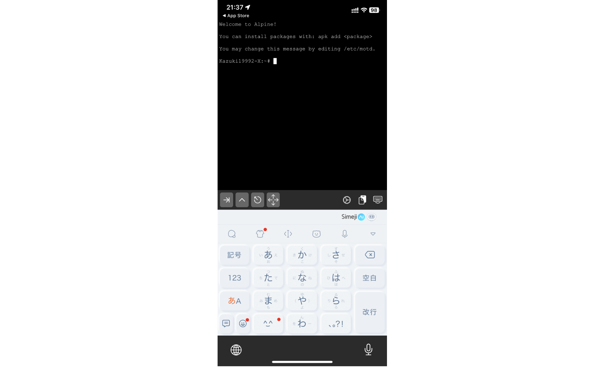

これでshell環境がiPhoneの中に入ってしまいました。やばすぎる。すごすぎる。すごすぎてすごい。

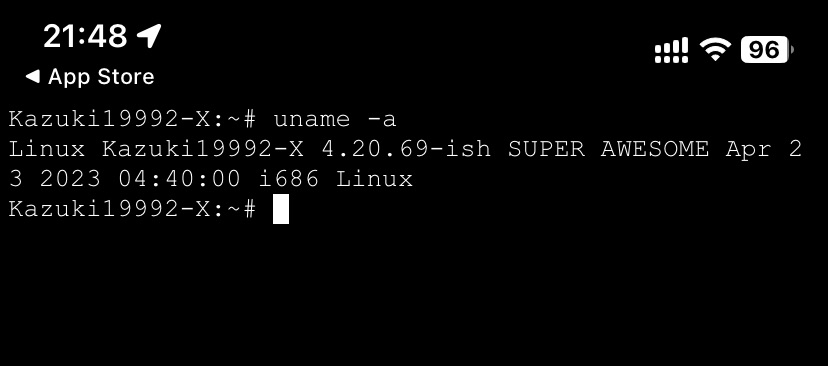

### Vimを入れてみよう

次にエンジニア御用達エディタのVimを入れてみましょう。`Alpine Linux`が動いているので、`apk`を使用すればアプリケーションを入れることができるはずです。

```shell
apk add vim
```

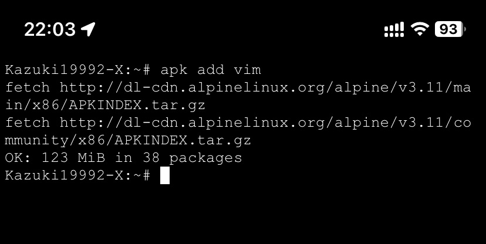

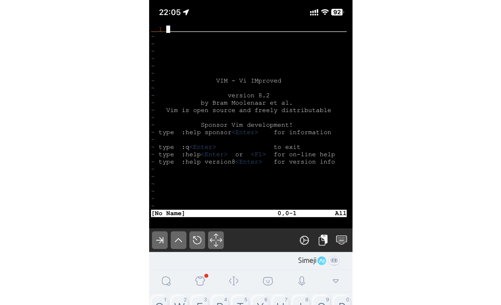

iPhoneでVimが動いてしまいました。単純にiPhoneでVimが動いている画がおもろいですね。

### Node.jsを入れてみよう(18.16.0 LTS)

**最初にお詫びですが、この項は時間がかかるためやめたほうがいいです。無駄な文を書いてごめんなさい。Node.jsのビルドを行うためかなりの時間がかかります。筆者は心が折れたのでこの次の項で12系のNode.jsをapkで入れています。**

次はNode.jsを入れてみましょう。

今回はnvm<span class="footnote">Node.jsのバージョン管理ツールです。<br />　他にVolta, nodenvなどがあります。筆者はVolta推しです。楽にバージョンを切り替えられるのはもちろん、`volta pin`でpackage.jsonにNode.jsやYarnなどのバージョンを記述し、自動でそのバージョンにVoltaが変更してくれるので、メンバー間の環境差異を減らせます。あとRust製でめっちゃ早いです。あとWindows, macOS, LinuxなどなどOSが違ったとしても同じコマンドを使用することができてとても嬉しいです！！！みんなも使おうな！！！(超絶早口オタク)<br />　今回も使おうとしたのですが、Alpine LinuxのARM64に対応していないようなので今回は諦めます。[https://volta.sh/](https://volta.sh)</span>を使用して記事作成時点の最新LTSである18.16.0を入れていきましょう。


まず、`curl`と`bash`などが必要なので、入れてしまいましょう。

```shell
apk add -U curl bash openssl\
	ca-certificates ncurses coreutils\
	make gcc g++ libgcc linux-headers\
	grep python2 util-linux\
    binutils findutils
```

`curl`と`bash`のインストールが終わったら`nvm`を入れていきます。最新のインストールコマンドは[GitHubの nvm-sh / nvm](https://github.com/nvm-sh/nvm#install--update-script)で確認してください。(以下のインストールコマンドは長いので改行しています。)

```shell
curl -o-
https://raw.githubusercontent.com/nvm-sh/nvm/v0.39.3/install.sh
| bash
```


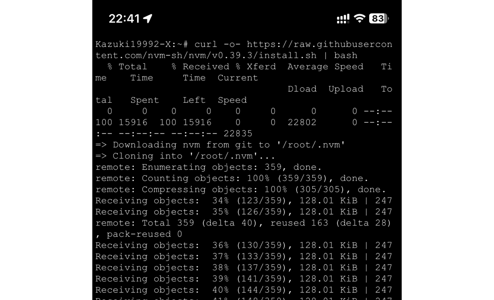


さて、nvmのインストールが終わったら、`NVM_DIR`のパスを通す必要がありそうです。<span class="footnote">手元のiPhoneでは下のコマンドを叩いてパスを通す必要があった。</span>

まず、`bash`に移動しましょう。

```shell
bash
```

その後、次のコマンドを叩いてパスを通します。(文字数の関係で改行しています。)

```shell
export NVM_DIR="$([ -z "${XDG_CONFIG_HOME-}" ]
 && printf %s "${HOME}/.nvm"
 || printf %s "${XDG_CONFIG_HOME}/nvm")"
 [ -s "$NVM_DIR/nvm.sh" ]
 && \. "$NVM_DIR/nvm.sh"
```

ここまでくればようやくNode.js 18をインストールすることができます<span class="footnote">インストールできませんでした。</span>！！長かったね。

```shell
.nvm/nvm.sh && \
    nvm install -s --lts && \
    nvm use --lts
```

ここで、`-s`オプションを渡してNode.jsをビルドします。ちなみにアホみたいに時間がかかります。AlpineにNodeを入れる際に私が参考にしたZennの記事では30分かかったって書いてありました。

かなり時間かかりそうなので私は心が折れました。面倒くさいので`apk add`で入ってくる12系を使うことにします。ここまで読んでくれた人ほんとうにごめんね。この記事を書きながら手元のiPhoneで試しているからこういうこともあるわね。

### Node.js 12系で妥協しよう

ちょっと頑張ったけど諦めます。Node.jsの12系を`apk`を使って入れちまいましょう。

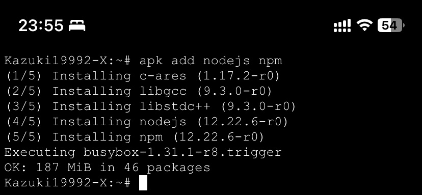


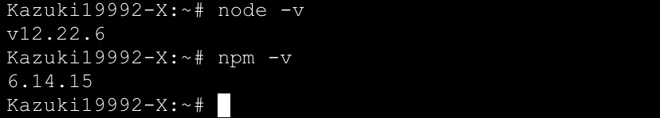

さて、これでNode.jsが入ったので次はいよいよWebアプリケーション開発です！

### Webアプリケーションを作ろう！

一旦休憩していたらiPhoneのバッテリーが落ちてしまったため、ここから手元のiPadで作業をしていきます。

早速コードを書いていきましょう。

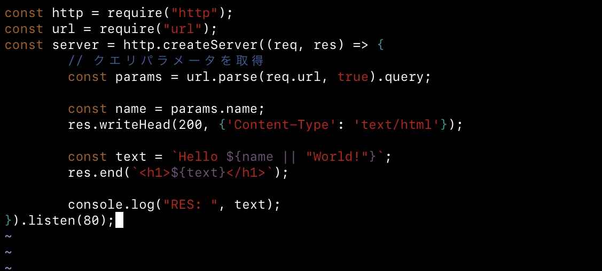

かなり雑に書いてみました。Reactとかも使わず、クエリパラメータで文字列が渡されたら `<h1>Hello 文字列</h1>`と表示し、文字列が渡されなければ`<h1>Hello World!</h1>`と表示するだけのめちゃくちゃ簡易的なWebアプリケーションです。これでいいのです。

### ブラウザで確認してみよう！

ブラウザで`localhost`にアクセスしてみましょう。

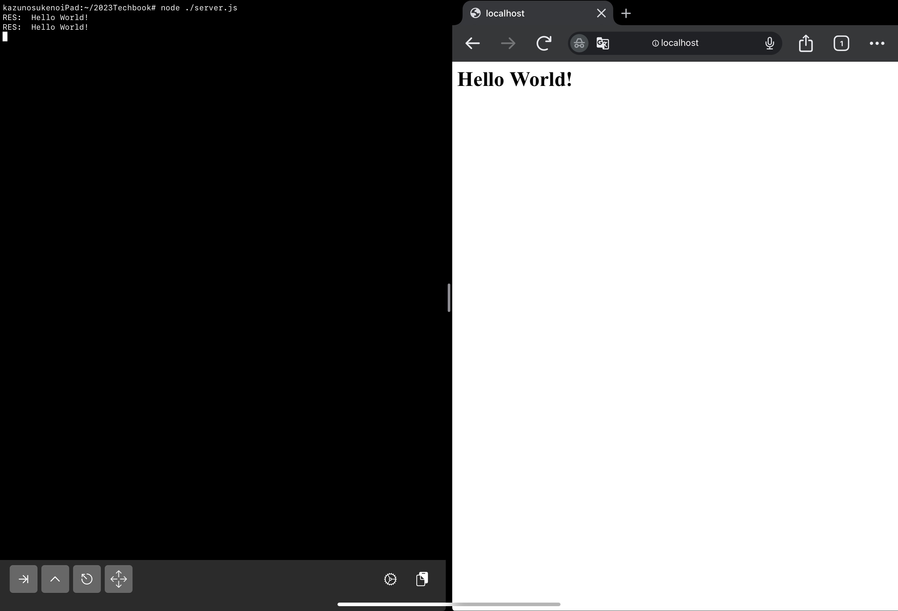

次に、`localhost?name=カズ之助`にアクセスしてみると……?

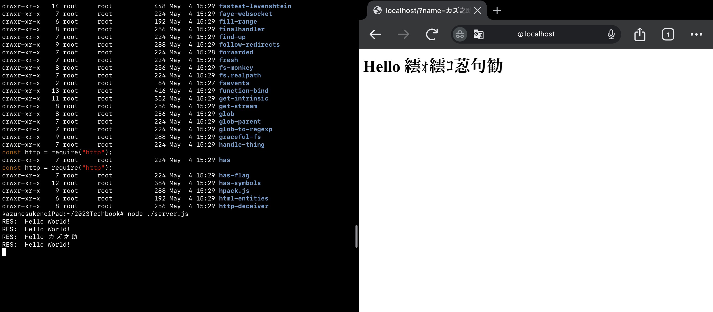

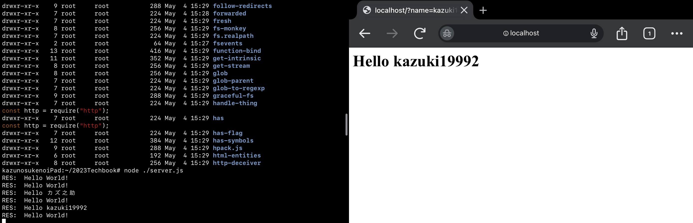

## 3. 完走した感想

***iOS端末でWeb開発はできない***<span class="footnote">できるけどやらないほうが良い。技術的には可能です。</span>！！！！

でも、iOS端末内でAlpine Linuxが動いて、たまに使うVimが動いて、Node.jsまで動いているので、一通りの開発はできないこともなさそうな感じがしました。

はじめこそ`create-react-app`を使って楽にWeb開発とか考えていましたが、実際にやってみると、`npx create-react-app .`で`segmentation fault`を起こしたりとか、いろいろWeb開発を行うには課題があります<span class="footnote">もともとそういう用途で作られたものではないだろうし……</span>。おとなしくハードオフとか秋葉原のイオシスとかで中古のPCを買ってきたほうが楽にWeb開発できて幸せだと思います。

しかし、普段PCで使っているソフトウェアが手元のスマートフォン/タブレットで動作するのはとても不思議な光景でとても楽しいですね。いろいろ触ってみようと思いました。みなさんもいろいろ遊んでみてね。

