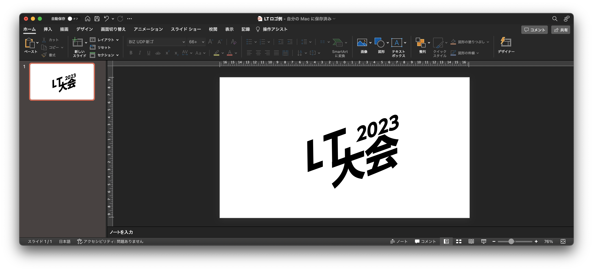
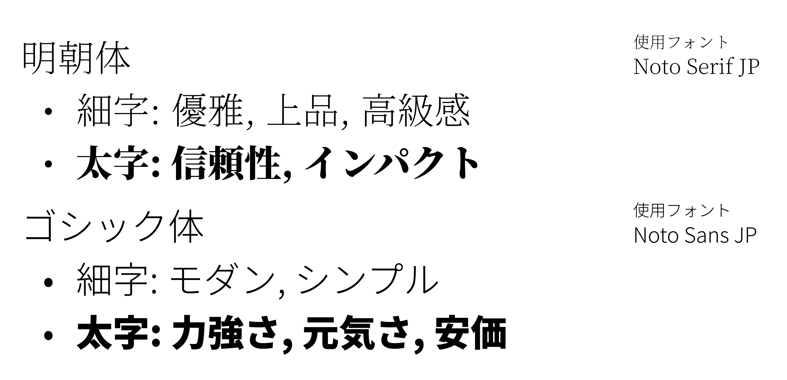

  <!-- 記事タイトル -->
  <h1 className="title-text">お前もイベント主催者にならないか</h1>

  

      <!-- 下の画像URLを自分のアイコン画像にすること -->
      
    

      <!-- 自分の名前 -->
      カズ之助 - @kazuki19992
      <!-- ひとことコメントor記事概要 -->
      逆張りクソめんどオタクなので鬼滅の刃まだ見てなかったワ
    

  

<!-- 以下本文 -->

この記事の内容は私が以前Zennに投稿した、[学生LT会、主催してみた！w](https://zenn.dev/kazuki19992/articles/7289651e3553e5)をベースにちょっと色々書いてみた記事です。

## ITイベントの主催者にならないか

どうも、カズ之助くんです。みなさんITイベントってやったことあります？
connpassとかに載ってるイベントに参加したことはあれど、イベントを開いてみた経験のある方って
実は意外と多くないんじゃないかと思います。

このコラムはイベントを主催する側も楽しいよということを伝えるための記事です。「イベントやってみたいけどこわいな」というエンジニアに刺さればいいなと思って書いてます。

なお、このコラムでは、LT会を開くことを想定して執筆していますが、割と色々なイベントに応用できるかもです。イベントやってみたくなったら参考にしてくれると嬉しいな。

## そもそもなぜイベントを開くのか

イベントを開く理由なんて人それぞれです。仰々しい理由じゃなくていいです。「{他人|ほかんちゅ}のおもろ話が聞きたい！」程度の理由で{無問題|もーまんたい}です。
ちなみに私は「田舎だから自分が開催しないとイベント自体が存在しないのでつまらん」でした。

下記によくありそうなイベント開催の理由を挙げてみました。ここにひとつでもビビッと来るものがあったらあなたは立派な主催者です。
ぜひその手でイベントを開いてみてください。

- 自分の知らない技術に触れてみたい！
- イベントがないと個人開発する気にならないんだよね
- おもしろオタクと話してみたい！
- 懇親会でオタクと酒飲みたい！
- 田舎だから自分が開かないとイベント自体が存在しないからつまらん！←これワイくん

## イベント開催のながれ

めっちゃざっくり言うと、準備→本番→懇親会の流れです。詳しく見ていきましょう。

### 準備

イベントの準備でやることは結構色々あります。とはいえ、結局どんなイベントをするかによってかなり大きく変わってくるのであくまで参考程度にしてください。
私が過去開催していたLT会では、主にこんな感じのことをやりました。

- 共同主催とのスケジュール調整
- イベント宣伝ページの作成
- LTテーマの決定
- ロゴの作成
- ゲストのお誘い
- 参加者募集
- Discordサーバーの作成/整備
- タイムテーブル作成
- アンケート作成
- 各種スライド準備
- 会場の確保

**「やることが‥やることが多い‥！！」** そんな声が聞こえてきたような気がします。  
やること多いと大変だよね。わかるわかる。

#### 別にそこまで大きなものをやりたいわけじゃないという人は……

別にこれ全部やらなくて大丈夫です。
まずはやること削って小さくはじめてみるのもいいと思います。

単独主催だったら共同編集とのスケジュール調整なんていらないし、仲間内でLT会やるなら大々的に参加者募集なんてしなくても良さそう。そう考えたら「ちょっとやってみてもいいかもしれない」って思いません？
そこで、仲間内で小さくLT会するときなどの最小構成を考えてみました。

- 日程決め
- タイムテーブル作成(発表順決定)
- 各種スライド準備(あると当日楽かもだけど、なくても喋れるならいらない)

なんとこれだけでもうイベントできる！！！！！！！！  
イベント中に発表順を決めてしまえば「いつやるか」さえ決めてしまえばそれで準備完了です！どうですか？？
かなりイベントをやるハードルが下がっていませんか？

## 早速イベントを開いてみよう！

さて、早速ですがイベントを開いてみましょう！

やったほうがいいかもリストを以下に示します。ここからやっておくと良さそうなものを取捨選択してイベント準備していきましょう！

これからあなたが開催しようとしているイベントの規模によって何が必要であるかが変わってきます。「これはやらなくていいや」と思うものは読み飛ばしてしまって構いません。やりやすいようにやりましょう。

今回は先述の通りオンラインでLT会を開くことを想定して執筆しています。しかし、オフラインイベントや、ハッカソンなどのLT会ではないイベントを開く際にも多少参考になると思います。

| ✅                       | やること                       | 対象イベント   | 備考           |
| ----------------------- | :----------------------------- | -------------- | :------------- |
| <input type="checkbox"> | 日程を決めよう！               | 全イベント     | これはやるべき |
| <input type="checkbox"> | テーマ, コンセプトを決めよう！ | 全イベント     |                |
| <input type="checkbox"> | イベント名を決めよう！         | 中〜大規模向け |                |
| <input type="checkbox"> | ロゴを作ろう！                 | 大規模向け     |                |
| <input type="checkbox"> | タイムテーブルを作ろう！       | 全イベント     | これはやるべき |
| <input type="checkbox"> | イベント会場を作ろう！         | 中〜大規模向け |                |
| <input type="checkbox"> | イベントページを作ろう！       | 中〜大規模向け |                |
| <input type="checkbox"> | 参加者を集めよう！             | 全イベント     | これはやるべき |
| <input type="checkbox"> | 参加者アンケートを作ろう！     | 全イベント     |                |
| <input type="checkbox"> | 必要なスライドを作ろう！       | 中〜大規模向け |                |

### 1. 日程を決めよう！

さて、まず日程だけ決めてしまいましょう。いつがいいですか？まず何をするにも終わりを決めておくとその後の予定が立てやすくなります。

もうすでに参加者が決まっている場合は[調整さん (https://chouseisan.com/)](https://chouseisan.com/)などの日程調整アプリを使うと楽に日程を決められて良いと思います。第一候補を濃い緑、第二候補を薄い緑で表示してくれるのでとても使いやすいと思います。こんな天才Webアプリを無料で使えていいんですか！？！？！？！？いいんです！！！ミクステンドさん本当にありがとうお世話になってます。

参加者が決まっていない場合は参加者が集まりやすそうな日時に設定すると参加者が集まりやすいと思います。例えば、土日や平日の19:00以降などが挙げられます。特に土日にすると技術系の大学生なども集まりやすいかもしれません。少なくとも私の平日は大学の講義/研究や生きるためのバイト、レポートなどの課題をこなした上で趣味開発をしていたため土日のイベントのほうが参加しやすかったです。このへんは人によります。

### 2. テーマ/コンセプトを決めよう！

**誰に**、**何を**発表してほしいのかを決めましょう。"初心者向け", "フロントエンドエンジニア向け"といった対象参加者や、"Reactオンリー", "無駄開発オンリー"などのテーマを決めていきます。

ここが明確になっているとイベント名を考えやすくなったり、ロゴを考える際のヒントになったりします。

以下に、一例を示します。(**太字**が対象者, <u>下線</u>が発表してほしいテーマ)

- **初心者** に <u>最近触った技術について</u> 5分でLTしてほしい！
- **学生エンジニア** に <u>無駄開発で作ったもの</u> を10分で発表してほしい！
- **すべてのエンジニア** に <u>技術系の自由なテーマ</u> で10分喋ってほしい！！

### 3. イベント名を決めよう！

イベント名を考えてみると主催者も参加者もモチベが上がります。シンプルなものも良いですし、AとBをかけ合わせたダジャレみたいなタイトルも良いでしょう。

以下にイベント名の一例を示します。

- **サークルA × サークルB 合同LT会**
  - シンプルでわかりやすいタイトルです！
- **初心者大歓迎！GrowUp LT！**
  - 初心者向けのコンセプトが伝わりやすいタイトルです！
- **PiyogrammerConference**筆者が過去に開催したイベントです
  - "プログラマー"と、ひよこの鳴き声"ぴよ"をかけ合わせたタイトルです！

イベント名が思い浮かばなければ、他の運営メンバーや、身近な人に聞いてみると良いと思います。一人で抱え込むようなものではないですし、色んな人に聞くといろんなアイデアが出てきて面白いですよ！[ChatGPT (https://chat.openai.com/)](https://chat.openai.com)に聞いてみるのも手かも？

#### イベント名を考えてみよう！

さて、ここでは筆者がよくイベント名を考えるときに使う方法をご紹介します。参考になれば幸いです。マインドマップを使用してイベント名を考えていきます。今回はマインドマップを描くのに[Mindmeister (https://www.mindmeister.com/)](https://www.mindmeister.com/ja)を使用しています。お気に入りのツールがあればそちらをお使いください。

##### 1. コンセプトをまとめる

マインドマップのrootに「イベント名」と書き、コンセプトをマインドマップの第一レベルに書いていきましょう。

##### 2. コンセプトから連想される単語を羅列してみる

コンセプトから連想される単語をつなげてみましょう。先の例では「学生エンジニア」という単語から「Study」や「大学生」という単語が連想されます。

##### 3. 単語をかけ合わせてみよう

単語を羅列してみたら、その中からうまく掛け合わせられそうな単語を掛け合わせてみましょう。

今回だと、例えば"Study"と"アウトプット"で"**StdOut**"筆者が過去に開催したイベントですなんてどうでしょう？

### 4. ロゴを作ろう！

もし、あなたが大きなイベントをしようとしているのであれば、ロゴを作るととても見栄えの良いものになると思います。後の章でイベントの参加募集ページを作るのですが、イベントのロゴがあると目に留まりやすいでしょう。ただ、必ず作る必要があるわけではないうえにそこまで優先度が高いわけではないため、面倒くさければ後回しにしたり、いっそのことロゴを作らないのもひとつの手です。

#### どんなツールでロゴを作るべき？

いろいろなツールがありますね。もちろんあなたがAdobeのIllustratorなどを使えるのであればそれを使うのが一番良いと思います。

もし、「Adobe Creative Cloudを契約していないよ！！」といった方や「Adobeは宗教上の理由で使うことができません」という方、「Linux環境をメインで使っているのでAdobeを入れることができない……」といった方は他のツールを検討する必要があります。Adobe以外でロゴ画像を作るとした場合、以下のソフトウェアが選択肢に上がってくると思います。

- OS標準のペイントソフト
- AviUtlなどの動画編集ソフト
  - 標準機能やプラグインで画像出力を行えるものがあります。
- WordやPowerPointなどのOffice系ソフトウェア
- FigmaなどのWebデザインソフト

#### FIgmaでロゴを作ってみよう

筆者は普段Adobe XDでロゴを作っていますが、Adobe XDが今後どうなるかわからないため、今回は[Figma (https://www.figma.com/)](https://www.figma.com/)でロゴを作る例をご紹介します。

今回は初心者向けLT「Grow UP LT 2023」のロゴを作っていこうと思います。

##### 1. キャンパスに必要な文字を置いていこう

必要な文字をとりあえずキャンパスに出していきましょう。このとき、面倒くさくとも1文字ずつにしておくと配置のときに楽になります。

##### 2. ざっくり配置していこう！

必要な文字をざっくり配置していきましょう！ここで、単語を構成する文字どうしをグループ化しておくと楽に配置することができます。

これはちょっとした知見ですが、文字を斜体にした上に文字列全体を画像のように傾けると、なんかそれっぽくちょっといい感じになります。ぜひ参考にしてみてください。

##### 3. フォントを変更しよう！

日本語フォントには大きく分けて「明朝体」「ゴシック体」があります。ほかにも「筆文字」など色々ありますが今回は明朝体とゴシック体に絞って話を進めていきます。明朝体とゴシック体で人に与える印象は異なります。めちゃくちゃ簡単にまとめてみました。参考: [https://www.togu.co.jp/column/detail/120](https://www.togu.co.jp/column/detail/120)

実際に選択すべきフォントを誤ってしまうと、下の画像のようにお買い得品なのに高そうに見えてしまったり、逆に高級品なのにお安く見えてしまったりします。

このフォントの選択はとても大事で、例えば明朝体の細字でロゴを組み立ててしまった場合、相当うまくデザインしないと初心者お断り感が出てしまいます。逆に極太ゴシック体でデザインすると「気軽に入れそう！」という印象を与えることができます。標準の細いゴシック体はモダンでシンプルな印象を与えることができるので、イベントによってはこのままでも全然問題ないと思います。スッキリしていて見やすいですし。

今回は"Grow UP LT"の部分をHelvetica Neue Bold Italic, "2023"の部分をHelvetica Neue Italicにしました。

##### 4. 色をつけて装飾をしよう！

さて、ここまででだいぶロゴっぽくなってきました。うれしいですね。テンション上がるなぁ〜〜〜！！

ここからはロゴに色をつけて、ついでに装飾もしていきましょう。

ここからは私の好き嫌いな話になってくるのですが、個人的に気になるところを描いてみました。特に下の余白が気になります……。

まず、下の「気になる余白」と書いてあるところを三角で埋めてしまいます。

とりあえずは一旦これでよしとします。この三角の部分がのっぺりしてしまうので、主催グループの名前とかを書いてみると良いかもしれません。下に載せてみた例を示しますが、今回は特に何もせずに進めます。

色を塗っていきます。なるべく黒(`#000000`)や赤(`#FF0000`)緑(`#00FF00`)青(`#0000FF`)などの原色は避けましょう。色が強すぎて目がチカチカしてしまいます。

今回の例では、初心者向けということで、初心者マークの色である緑と黄色を明るい感じで使っていきましょう。黒のベタ塗りをなくすために、グレー(ここでは`#545454`)を使っていきます。三角の部分を緑や黄色一色でベタ塗りしてしまうとのっぺりするので、グラデーションを使っていきます。Growの部分も下の三角に合わせてグラデーションにしてしまいましょう。

後は小物を追加したり、ちょっとした装飾を加えていきます。そうですね……Pの隣、2023の上辺りに小さい初心者マークを置いて、Uを上向きの矢印にしてしまいましょう！

このように作ってみました。あとは文字詰めなどを適切にすると良いと思います。

#### ロゴ作成に関して

ロゴ作成にかなりのページを割いてしまいました(画像が多くなったため)が、ロゴはあくまで「あるといいね」というものです。必ず作らなければならないものではないので、無理して作る必要はないと思います。ただ、もし時間に余裕があるのであれば、ペイントやPowerPoint、Figmaなど使いやすいツールでロゴ作成に挑戦してもらえるとかなり見栄えの良いイベントページになると思います。

### 5. タイムテーブルを決めよう

さて、思いの外ロゴ作成にページを割いてしまいました。ここまで読むのも疲れたと思います。ごめんなさい。

ここではイベントのタイムテーブルを作っていきましょう。ざっくりスケジュールで構いません。発表順などはイベントのオープニングであみだくじなどで決めてしまいましょう。そのほうが盛り上がるし。

LT会を開く場合、イベント全体の時間から、運営側で必要な時間と休憩時間を差し引いたすべての時間をLTに充ててしまいましょう。

運営側で必要な時間は以下のものがあります。

- オープニング
  - 内容にもよるが5分から30分くらい。
- クロージング
  - 内容にもよるが5分から30分くらい。なくても良い。

なんとざっくりでしょう。困った。これじゃスケジュールを組み立てられないじゃないか！どうしよう！オーマイガー！

#### オープニングでなに話す？

とりあえず、オープニングで何を話すかを決めましょう。話はそれからだ。

前述の通り、登壇順をオープニングでシャッフルして決める場合は、それで5分程度(どれだけ多く見積もっても10分程度)かかります。

あとは運営チームの自己紹介とかもすると人にもよりますが1分〜5分ほどかかったりします。

イベントの説明も必要ですね……5分〜10分程度見積もると良いかもです。

行動規範やアンチハラスメントポリシーを定めているしっかりした運営チームだとその紹介とかも必要ですね。

このイベントにスポンサーが付いていた場合はその紹介もいるでしょう。5分程度見ておいたほうが良いかも？

何を話すかによって5分〜30分程度かかります……

| ✅                       | 話す内容                             | 何分程度かかるか |
| ----------------------- | ------------------------------------ | ---------------- |
| <input type="checkbox"> | 運営チーム自己紹介                   | 1分〜5分程度     |
| <input type="checkbox"> | イベントの説明                       | 5分〜10分程度    |
| <input type="checkbox"> | 行動規範, アンチハラスメントポリシー | 3〜5分程度       |
| <input type="checkbox"> | 登壇順決定                           | 5分〜10分程度    |
| <input type="checkbox"> | スポンサー紹介                       | 5分〜10分程度    |

私がイベントを開催するときは30分オープニングの枠として時間をとっておき、早めにオープニングを終わらせた後は休憩時間としています。この時間に登壇者の皆さんには登壇準備を終わらせてもらいます。

### 6. イベント会場を作ろう

ここではイベント会場を作っていきます。今回はDiscordを例に紹介します。

#### Discordって？

[WikipediaのDiscordのページ(https://ja.wikipedia.org/wiki/Discord)](https://ja.wikipedia.org/wiki/Discord)にはこのように書かれています。

> **Discord**（ディスコード）は、[Windows](https://ja.wikipedia.org/wiki/Microsoft_Windows)・[macOS](https://ja.wikipedia.org/wiki/MacOS)・[Linux](https://ja.wikipedia.org/wiki/Linux)・[Android](https://ja.wikipedia.org/wiki/Android_(オペレーティングシステム))・[iOS](https://ja.wikipedia.org/wiki/IOS)・[Webブラウザ](https://ja.wikipedia.org/wiki/ウェブブラウザ)で動作する、[インスタントメッセージ](https://ja.wikipedia.org/wiki/インスタントメッセージ)（コミュニケーションサービス・チャットアプリ）・ビデオ通話・[音声通話](https://ja.wikipedia.org/wiki/音声通話)・[VoIP](https://ja.wikipedia.org/wiki/VoIP)[フリーウェア](https://ja.wikipedia.org/wiki/フリーウェア)である。[アメリカ合衆国](https://ja.wikipedia.org/wiki/アメリカ合衆国)で開発されており、[2019年](https://ja.wikipedia.org/wiki/2019年)5月時点でユーザー数が2億5000万人に達している[[3\]](https://ja.wikipedia.org/wiki/Discord#cite_note-3)。

メチャクチャ簡単に言うとビデオ通話, 音声通話, チャットやファイル送受信ができるコミュニケーションアプリケーションです。とても使いやすいので割とおすすめしています。夫婦や家族, 恋人間の連絡に使っている人もいるようです。使ったことがない方はぜひ使ってみてください。

#### イベント会場を作ってみよう

イベント用のDiscordサーバーはすでにあるものとします。サーバーはアプリ内で無料(2023/05/07現在)で簡単にアプリ内で作ることができます。

既存のDiscordサーバーを利用する場合はこの章はスキップしていただいてOKです。

サーバーにあると便利なルームを次の表に示します。

| ルーム     | 音声/テキスト  | 目的                                                         |
| ---------- | -------------- | ------------------------------------------------------------ |
| 会場       | 音声ルーム     | イベント会場                                                 |
| 実況       | テキストルーム | 実況用 視聴者がリアルタイムで反応できる場所 Twitterなどで良ければ作らなくてもOK |
| 資料置き場 | テキストルーム | 登壇者が資料のPDFファイルや SpeakerDeck, GoogleスライドのURLを載せる場所 |
| アナウンス | テキストルーム | 主に主催者から参加者に向けて アナウンスを行う場所       |

この4つのルームが最低限あると良いでしょう。

アナウンスチャンネルと実況チャンネルを分けているのは実況チャンネルの流速が速く、主催者であるあなたからの大事な天の声が埋もれてしまうことを防ぐためです。

資料置き場は後でイベントの振り返りを参加者が行いたいときに大変便利です。また、当日急用で参加できなくなってしまった参加者もなんとなくの発表内容を知ることができます。

### 7. イベントページを作ろう！

イベントページを作っていきましょう。主にconnpassが有名所ですね。

イベントページには以下の内容を書くと良いかもしれません。

- イベント日時
- 行動規範, アンチハラスメントポリシー(あれば)
- 募集内容(参加枠)
- イベントの説明
- LTの説明(初心者向けのイベントであれば載せたほうが良いかも？)
- 当日のざっくりスケジュール
- 注意事項
- 会場案内(Discordの招待URL, Zoom URL)
- スポンサー紹介(あれば)

まず、載せるべき情報は「日時」「会場URL」「イベント説明」「募集内容」の4点です。最低限この4つがあれば参加者はイベントの趣旨と自分の参加枠がわかった状態でイベントに参加することができます。

イベント説明にはイベントのコンセプトや、どういうイベントなのかを簡潔かつわかりやすく書きましょう。connpassでは画像を載せることができるのでうまく有効活用すると良いかもしれません。

作成例として私の過去イベントのページ  
([https://otaku-project.connpass.com/event/225453/](https://otaku-project.connpass.com/event/225453/))を貼っておきます……。参考になれば幸いです……。

ここまでできればあとは人を集めてアンケートを作り、オープニング/クロージングのスライドを作れば完璧です！もう少し！！

### 8. 参加者を集めよう！

参加者がすでにある程度決まった状態であればこの章はスキップしてください。

この章ではただひたすら参加者を集めます。大規模にイベントを行いたい場合は友人知人の{力|ちから}やTwitterの{力|ちから}を使って大規模にイベントの宣伝をしましょう。イベントページのリンクを添付して「イベントをやるよー！」ということを伝えましょう！

内々でイベントを行う場合には、メンバー向けにイベントページのリンクを共有しましょう。

### 9. アンケートを作成しよう！

ここまで大変でしたね。お疲れさまです。

アンケートをここでは作っていきます。必須ではないですが、せっかく開くイベント「楽しかったー！」とか「また開いてー！」の声を聞きたくないですか？

ここまで頑張ってきました。せっかくなので参加者にいっぱい褒めてもらいましょう。参加者からのフィードバックは「大変だったけど、また次も開いてみようかな」という原動力になると思います。

#### 設問

1. あなたは登壇者ですか？視聴者ですか？
2. 5段階で満足度を教えて！(必須)
3. 良かったところを教えて！
4. 改善点があったら教えて！
5. 次回また同じような会があったら参加したい？
6. 感想とかいっぱい教えてね！

GoogleFormは入力した問題文に応じていい感じの選択肢に変化するのがとても楽で推しています。サンキューGoogle Form、フォーエバーGoogle Form。

最後に答えてくれた人へのお礼のコメントも忘れずに書いておきましょう。

### 10. 各種スライドを作ろう！

これで最後です。お疲れさまでした。最後は運営やLT(登壇するのであれば)で必要になってくるスライドを作りましょう。

#### オープニングで何をしゃべるべき？

オープニングで何をしゃべるかによって書く内容は変わってきます。基本的にはオープニングでしゃべることに合わせて書いていきましょう。

[PiyogrammerConference 2021](https://speakerdeck.com/kazuki19992/piyoconf2021-opuningu)[https://speakerdeck.com/kazuki19992/piyoconf2021-opuningu](https://speakerdeck.com/kazuki19992/piyoconf2021-opuningu)の例をご紹介します。余分なものを削って、足りないものを付け足すなどしてオリジナルのオープニングスライドを作りましょう！

1. 各規約の説明
   1. 行動規範
   2. アンチハラスメントポリシー
2. 運営紹介
3. イベント説明
   1. イベント名の説明
   2. 参加方法
   3. 実況方法
   4. 会の目的
   5. LTの説明
4. 協賛の紹介
5. ゲストの紹介
6. LT登壇者紹介
7. タイムテーブルの紹介

主催グループに行動規範やアンチハラスメントポリシーといった規約類が制定されているのであれば、参加にあたって同意が必要です。オープニングの最初にそのことを伝えましょう。その後に、運営しているのが誰か、どんなイベントなのかの紹介があると盛り上がります。Twitterでの実況ハッシュタグの紹介などもあると参加者が実況しやすくなって更に盛り上がるでしょう。

#### クロージングで何を話すの？

オープニングは話すことがあるので良いですが、問題はクロージングです。何を話しましょう。

とりあえずクロージングでやってほしいことはアンケートへの回答です。アンケートのQRコードを画面に載せて参加者に回答してもらいましょう。

アンケートを書いてもらっている間の時間、運営は何をしましょう……。次のイベントの話や、ちょっとしたLT、今回の振り返りをしたりなど、参加者が片手間で聞ける適当な話をするのも良いですし、BGMを流しながら5分程度何もしないをするのも手です。ある程度時間が経ったら、懇親会(するのであれば)の話をしましょう。懇親会をしないのであれば「これでおしまい！みんなきてくれてありがとう！」で終了しても問題ないと思います。

懇親会の話で何をするかというと、懇親会の開始時刻と、懇親会の場所(Zoom, Discordルーム)の案内イベント本編と同じであれば不要です。が必要です。

私の過去イベントのクロージング資料です。参考になれば幸いです。[#stdout2020 クロージング](https://speakerdeck.com/kazuki19992/number-stdout2020-kurozingu)[https://speakerdeck.com/kazuki19992/number-stdout2020-kurozingu](https://speakerdeck.com/kazuki19992/number-stdout2020-kurozingu)

### 11. イベント本編でやること

ここまでで準備OKです！大変お疲れさまでした。本当に疲れたと思います。ここからは本番で行うことを軽く紹介します。

#### 1. 登壇順の決定

登壇順をシャッフルで決定する場合は、オープニングの後に登壇順を決定する必要があります。

Googleで「順番 ランダム ツール」などで調べると色々出てくるので使いやすそうなもので順番を決定しましょう。GoogleのスプレッドシートやExcelで順番を決めるでもいいですし、MySQLでランダムソートした結果で順番を決めている人もいました……。あなたにとって使いやすいお好きなツールで登壇順を決定しましょう。

できれば当日までに少し触って、ツールに慣れた状態で本番を迎えられると良いですね！

#### 2. 進行

進行も運営のおしごとです。時計を見つつ、予定時刻に遅れがあれば終了時刻を伸ばすか休憩を短くするなどして対応しましょう。逆に時間よりかなり早めに進んでいるときは休憩時間を長めにとったり、発表が長引いた参加者のバッファーとして有効活用しましょう。早めにイベントを終わらせてしまっても良いですね！

オンラインイベントはオフラインイベントと違い、人に対しでではなくカメラ/画面に対して話します。「画面の先にいる参加者に対して話しているんだろ！」とおっしゃる方、ごもっともです。しかし、目の前にあるのはカメラ。「参加してくれている人に対して話している」というより「カメラに話しかけている」と言ったほうが緊張しにくくないですか？

イベントによっては顔出し不要のものもあるため、緊張しにくいと思います。落ち着いてゆっくり話しましょう。私はこの辺がまだ少し苦手です……。登壇の機会を積んでゆっくり落ち着いて話せるようになりたい……。

## イベントやるのって大変じゃん……

そうですね。そこそこ大きなものをやろうとすると大変だと思います……。ただ、仲間内で小さくLT会をするならここまでの準備は必要ありません。

例えば、「サークル内でちょっとしたLT会をする」場合は、やることが大きく減ります。

1. いつやるかを決める
2. ざっくりスケジュールを決める
3. サークルで使っている連絡ツールに「5月10日の15:00からDiscordでLT会するよ！みんな来てねー！」と投稿すればおしまいです。

イベント名も決めなくていいですし、ロゴマークなど作らなくて良いです。オープニングのスライドも作る必要がないので、その分の時間を自分の登壇資料に充てることができます。

人の話を聞きたいからここはあなたのイベントを開く理由を当てはめてくださいね。LT会をするのであって、準備に忙殺されたいからLT会を開くのではないと思います。できるだけ楽をしてイベントを開きましょう。

## おわりに

ここまで読んでくださり、{本当|ほんっっっとう}にありがとうございます。少しでも「イベント開いてみようかな……？」という気になっていただけたら徹夜して書いて甲斐があります。

ITイベントは技術者同士の交流の場でもあり、自分自身を含む参加者すべてが刺激を受けて、技術に対するモチベーションを大いに上昇できる場であると考えています。

大掛かりなイベントを開こうとすると準備が大変になってしまいますが、それぞれを簡易的にしたり、小さいイベントにしたりすることで格段に楽をすることができます。この記事でも、これからイベントを主催しようとしているあなたがカンニングできるように過去資料のリンクなどを適宜載せました。コピペやパクリスペクト歓迎なので、軽率にイベントを開いてみてください。

もっともっとイベントが開かれるといいなと思っています。私ももっとイベントを開きます！がんばります！

ここまで読んでくださって本当にありがとうございました。

