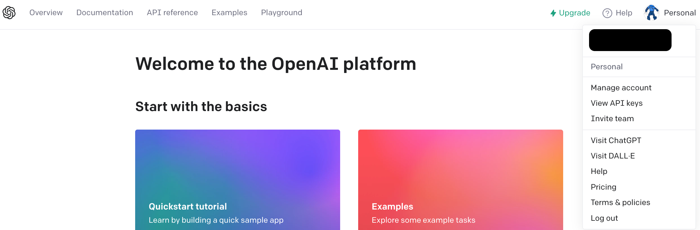

<div class="title-container">
  <!-- 記事タイトル -->
  <h1 className="title-text">のんのんChatGPTびより</h1>

  <hr />
  <div className="author-wrapper">
      <!-- 下の画像URLを自分のアイコン画像にすること -->
      
    <div className="author-name-wrapper">
      <!-- 自分の名前 -->
      <span className="author-name">たーりょー</span>
      <!-- ひとことコメント(Twitterのbioみたいな) -->
      <span className="author-bio">にゃんぱす〜！！</span>
    </div>
  </div>
</div>

<!-- 以下本文 -->

# にゃんぱす〜！！
にゃんぱす〜！！たーりょーです。
今回は VOICEVOX とChatGPT を利用して、**にゃんぱす〜！！** することで、
オタクの夢を叶えていきたいと思います。

## 利用技術紹介
今回利用したVOICEVOX とChatGPT の説明になります。

- VOICEVOX
  - 無料で使えるテキスト読み上げソフト
  - ずんだもんが有名だよねぇ〜。

- ChatGPT
  - 今話題の人工知能チャットボット
  - 乗るしかない。このビッグウェーブに!!!!

# なぜ"にゃんぱす〜！！"するとオタクの夢が叶うのか
ChatGPT では、アニメキャラや俺様系、おじさん構文など自分好みの役割を与えて対話することが出来ます。
また VOICEVOX には、声優の小岩井ことりさんを元データとした、No.7 というボイスアバターが存在します。

察しが良い読者の方なら「なるほど〜」と思っているかもしれませんが、
小岩井ことりさんは「のんのんびより」の宮内れんげちゃんの声を担当している声優さんでもあります。
つまり、**宮内れんげちゃんと会話するオタクの夢が叶う** ということです。

# 大まかな流れ

本記事の大まかな流れとしては、下記の通りになります。

1. ChatGPTを利用して、宮内れんげの口調でテキスト生成できる
2. VOICEVOX を利用して、小岩井ことりさんの音声データを生成・再生できる
3. 1.で生成したテキストを、2.での音声データで再生できる


それでは、１つずつ紹介・解説していきます。


## ChatGPT 編

こちらのChatGPT 編では、大まかな流れで紹介した通り、
目標を「ChatGPTを利用して、宮内れんげの口調でテキスト生成できる」と定め、
ChatGPTを利用するまでの手順と、ChatGPTを利用したテキスト生成、
役割を持たせたテキスト生成を進めていきたいと思います。

<hr class="page-wrap" />

### ChatGPTを利用するまでの手順

#### ChatGPT を利用するために、OpenAI のAPI キーを獲得しよう
まずは、ChatGPT を利用するために、
OpenAI のプラットフォームサイト<span class="footnote">https://platform.openai.com/</span>でアカウントを作成します。


アカウントが無事作成することが出来たら、
ホーム画面に切り替わるので、画面右上にある自アイコンをクリックし、
その中の **View API keys** を選択して、API キー発行画面に進んでいきましょう。



API キー発行画面では、**Create new secret key** を選択し、
API キーの名前を入力することで OpenAI のAPIキーを発行することが出来ます。
ここで発行したAPI キーは、後ほど利用するので、忘れずに保存しておきましょう。


### ChatGPTを利用したテキスト生成
先程作成した OpenAI の APIキーを用いて、
ChatGPTを利用したテキスト生成を行なっていきましょう。

下記のコマンドを実行すると、
Python で ChatGPT を利用するための、
OpenAI ライブラリがインストール出来ます。

```shell
pip install openai
```

ライブラリが無事インストール出来たら、
実際に ChatGPT を利用してテキスト生成するサンプルコードを動かしてみましょう。

```python
import openai

# 作成した OpenAI のAPI キーを入力
openai.api_key = OPENAI_API_KEY

def chat(input_text):

  # model に利用したいモデルを記述
  # gpt-3.5-turbo は, GPT-3.5版のChatGPTの最新モデルを利用
  # 'role': 'user' で, ChatGPT に対して質問することができる
  response = openai.ChatCompletion.create(
    model = "gpt-3.5-turbo",
    messages = [{
      'role': 'user',
      'content': input_text
    }]
  )
  output_text = response['choices'][0]['message']['content']
  print(output_text)

chat('アニメ「のんのんびより」について教えて')
```

以下にサンプルコードの実行結果を載せています。


### 役割を持たせたテキスト生成

それでは本題のChatGPTに、
「宮内れんげ」の役割を持たせたテキスト生成を行なっていきましょう。
役割を持たせるのは簡単で、先程のサンプルコードに少し要素を足すことで、
達成することが出来ます。

```python
import openai

# 作成した OpenAI のAPI キーを入力
openai.api_key = OPENAI_API_KEY

def chat(input_text):

  # model に利用したいモデルを記述
  # gpt-3.5-turbo は, GPT-3.5版のChatGPTの最新モデルを利用
  # 'role': 'system' で, 役割を持たせることができる
  response = openai.ChatCompletion.create(
    model = "gpt-3.5-turbo",
    messages = [{
      'role': 'system',
      'content': "\
        あなたは、のんのんびよりの宮内れんげです。\
        宮内れんげの口調で回答してください。\
        挨拶は「にゃんぱす〜！」です。\
        語尾に「〜のん」をつけるのが口癖です。\
      "
    },{
      'role': 'user',
      'content': input_text
    }]
  )
  output_text = response['choices'][0]['message']['content']
  print(output_text)

chat('アニメ「のんのんびより」について教えて')
```

以下にサンプルコードの実行結果を載せています。


しっかり「にゃんぱす〜！」と挨拶する、れんげちゃんっぽさを持ったテキストが生成されましたね。
これは誰がどうみても、れんげちゃんだ（断言したい）。

以上で、ChatGPT編の目標であった、
「ChatGPTを利用して、宮内れんげの口調でテキスト生成できる」が無事達成できました。
ばんざーい！ばんざーい！

## VOICEVOX 編

こちらのVOICEVOX 編では、大まかな流れで紹介した通り、
目標を「VOICEVOX を利用して、小岩井ことりさんの音声データを生成・再生できる」と定め、
VOICEVOX を利用するまでの手順と、音声データの生成・再生を進めていきます。

### VOICEVOX を利用するまでの手順

VOICEVOX を利用する方法として、以下の２つがあります。

1. VOICEVOX <span class="footnote">https://voicevox.hiroshiba.jp/</span> のサイトからダウンロードして利用する
2. Docker で提供されているコンテナイメージから利用する

今回は、Docker で提供されているコンテナイメージを利用することにしました。

### 

```yaml
version: '3'

services:
    voicevox_server:
      container_name: voicevox-server
      image: voicevox/voicevox_engine:cpu-ubuntu20.04-latest
      ports:
        - "50021:50021"
      tty: true
```

もしGPU版を使いたいなら、image の部分を下記のように書き換えるだけで、
GPU版のコンテナを作成することが出来ます。

```diff
- image: voicevox/voicevox_engine:cpu-ubuntu20.04-latest
+ image: voicevox/voicevox_engine:nvidia-ubuntu20.04-latest
```

後は下記のコマンドを実行することで無事に VOICEVOX を利用する準備が完了となります。

```shell
docker-compose up --build -d
```


### 音声データの生成・再生

下記のコマンドを実行すると、
Python で VOICEVOX を利用するための、
requests ライブラリと、
音声データを再生するための、
pyaudio ライブラリがインストール出来ます。

```shell
# VOICEVOX とのデータのやり取りに利用
pip install requests

# 音声データを再生するために利用
pip install pyaudio
```

ここで注意点ですが、**pyaudio** にハマりポイントがあります。
インストールのコマンドを実行しても、「**portaudio.h** ファイルがないよ」などのエラーが発生してしまい、
インストールが失敗することがあります。
もし失敗してしまったら下記のコマンドを実行することで、
対処することができる場合があります。

```shell
# Homebrew がインストール済みなら下記コマンドを実行
brew install portaudio
```

ライブラリが無事インストール出来たら、
実際に VOICEVOX を利用して音声データの生成・再生を行うサンプルを動かしていきましょう。
サンプルを動かすには、下記の３つの手順で必要になってきます。

1. VOICEVOX を利用した音声合成用クエリの作成
2. 1.のクエリを用いて VOICEVOX による音声合成
3. 2.の結果による音声データの再生

#### VOICEVOX を利用した音声合成用クエリの作成

読み上げさせたいテキスト**input_text**と、
利用したいボイス**speaker_type**を入力値とし、
VOICEVOX とデータのやり取りを行い、音量や、音の高さ、速さなど、
音声情報を持つ音声合成用クエリを作成することが出来ます。

```python
import requests

# 先程の Dokcer で指定したport番号と合わせる必要があります。
# http://localhost:port番号
# VOICEVOXのサイトからダウンロードした場合でもこちらのURLからサーバ通信と出来ます
base_url = "http://localhost:50021"

def post_query(input_text, speaker_type):
  query_params = {"text": input_text, "speaker": speaker_type}
  response = requests.post(base_url + "/audio_query", params = query_params)
  response.json()
```

#### 音声合成用クエリを用いて VOICEVOX による音声合成

先程作成した音声クエリと、利用したいボイスなどを入力値とし、
VOICEVOX とデータのやり取りによる音声合成を行い、
音声データ**voice_response**を取得することが出来ます。

```python
import requests
import json

def post_synthesis(response, speaker_type):
  query_params = {"speaker": speaker_type}
  headers = {"content-type": "application/json"}
  query_response_json = json.dumps(response)

  voice_response = requests.post(base_url + "/synthesis", 
    data = query_response_json,
    headers = headers,
    params = query_params)

  voice_response.content
```

#### 音声合成結果による音声データの再生

最後に取得した音声データをスピーカーから、
再生するための手順を紹介します。

```python
import pyaudio

def play_voice(voice_response):
  p_audio = pyaudio.PyAudio()
  stream = p_audio.open(
    format = pyaudio.paInt16,
    channels = 1,
    rate = 24000,
    output = True)
    
  stream.write(voice_response.content)
  stream.stop_stream()
  stream.close()
  p_audio.terminate()
```

以上の３つの手順を順番よく実行させてあげることで、
好きなテキストを好きなボイスで再生させることができます。

```python
def sample():
    input_text = "技術書典はじまった〜のん。"
    speaker_type = 29
    response = post_query(input_text, speaker_type)
    voice_data = post_synthesis(response, speaker_type)
    play_voice(voice_data)
```

ちなみに VOICEVOX サーバで好きなボイスを利用するための **speaker_type** については、
VOICEVOX 起動中に、 **http://localhost:50021/speakers** をブラウザからアクセスすることで、
値の確認を行うことが出来ます。

ちなみに**宮内れんげ役の小岩井ことりさん**がボイスを担当している **No.7** のボイスは、
**29** を指定することで利用できます。

以上で、VOICEVOX 編の目標であった、
「VOICEVOX を利用して、小岩井ことりさんの音声データを生成・再生できる」が無事達成できました。
ばんざーい！ばんざーい！


## ChatGPT と VOICEVOX の合体編

それでは、今までの成果をまとめてみましょう。
まずはChatGPT 編での目標であった、
「ChatGPTを利用して、宮内れんげの口調でテキスト生成できる」によって生成されたテキストを、
VOICEVOX 編での目標であった、
VOICEVOX を利用して、小岩井ことりさんの音声データを生成・再生できる」と合体させてあげることで、
本記事の目標であった、**宮内れんげちゃんと会話するオタクの夢が叶う** を達成していきましょう。

```python
import openai

from chatgpt_sample import chat
from voicevox_sample import post_query, post_synthesis, play_voice

# 作成した OpenAI のAPI キーを入力
openai.api_key = OPENAI_API_KEY

def main():
    input_text = "自己紹介してください。"
    speaker_type = 29
    chatgpt_text = chat(input_text)
    response = post_query(chatgpt_text, speaker_type)
    voice_data = post_synthesis(response, speaker_type)
    play_voice(voice_data)
  
main()
```

上記の実行結果により、**宮内れんげちゃんと会話するオタクの夢が叶う** が達成できました！！！

# 感想
今回は、**宮内れんげちゃんと会話するオタクの夢が叶う** が無事達成することができました。(拍手)
しかし、まだまだ改良の余地は残されています。

- こちらの入力を音声入力にして会話感の向上！！
- 繰り返しによる対話感の向上！！
- ChatGPT による役割が甘い部分がある！！
- 絵やアバターを一緒に表示させて動かしたい！！

などなど、達成したいことがまだまだ出てきますので、
これからも継続して夢を追っていきます！！！

<p style='font-size:20pt; font-weight: 700;'>オタクの夢は終わらねぇぇ！！！</p>
