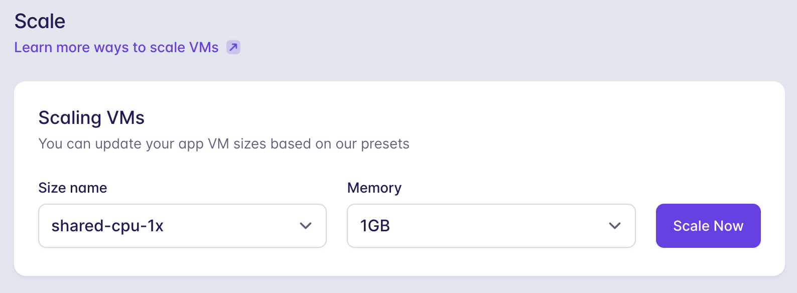

<div class="title-container">
  <!-- 記事タイトル -->
  <h1 className="title-text">実質無料でdiscord内でちくちくことばを使うと幼女に怒られるようにした話</h1>


  <hr />
  <div className="author-wrapper">
      <!-- 下の画像URLを自分のアイコン画像にすること -->
      
    <div className="author-name-wrapper">
      <!-- 自分の名前 -->
      <span className="author-name">せぐ</span>
      <!-- ひとことコメント(Twitterのbioみたいな) -->
      <span className="author-bio">自分用鯖に「ポケモンパンシール報告所」というチャンネルがあります</span>
    </div>
  </div>

</div>

## 雑談

みなさんはdiscordを使用されていますか？私はめちゃくちゃヘビーユーザーというわけではないんですが、所属しているコミュニティでのメインコミュニケーションツールとあってそこそこ使ってます。

## 本題

あるコミュニティで「NGワードの制定」をする機会がありました。特段何かトラブルがあったわけではなく、サーバー内の平和を守るためにうちでも一応制定しておこうか、という話の流れになったためやってみた、という平和的な動機です。

NGワードを洗い出して制定したは良いのですが、NGワードは「人が嫌な気持ちになってしまう可能性がある」ため発言を禁止する言葉です。そんなきったない言葉、他の人の目に触れる前に消しておいて欲しいですよね。そこで私はbotを作り、機械的にチェックして解決することにしました。

## 構想

最初はメッセージを送ったらチェックを入れ、NGワードが入っていると判定されたらそのメッセージを自動で削除するようにしようと思っていたのですが、誤判定で無実のメッセージを削除してしまうのは避けたい&そもそも権限的に無理そうだったのでやめました。その代わりに、botがこれはだめだよ！とNGワードの入ったメッセージに返信することで送信者に自省を促すアプローチに決定しました。

このアプローチで行くとなると、注意された時にムッとならず、あっこれは自分が悪いな…と思える人を模したほうがより効果的です。誰に注意してもらおうか考えた結果、「幼女」がこの条件に当てはまるという結論に至りました。人は幼女に弱いものです。幼女がその愛嬌を振りかざせば、それに逆らうことは誰も出来ません。世界の覇権は幼女が握っていると言っても過言ではないでしょう。今回はその無邪気さと可愛らしさを注意の緩衝材として遺憾なく発揮していただこうと思います。

それでは、「ちくちくことばを使ったら可愛く注意してくれる幼女bot」を作っていきましょう。

## 主な環境

- node.js v16.15.1
- discord.js v14.7.1
- kuromoji v0.1.2
- dotenv v16.0.3
- fly.io

昔なら無料で済ませたさ故にHerokuでやってたんですが無料プランがなくなってしまったので同じく無料でできるFly.ioにしました。実際のところkuromojiを動かすのとかで無料枠のRAMでは足りず、増強代として毎月$3.05かかっているのですが、fly.ioは「$5以内はホビープランの範囲内みたいなもんやろ」とのことで100%割引してくれてます(2023/05/07執筆当時)。神。みんなもfly.ioを使ってみよう！

## 制作過程

### 1. Discord側でbotを作成し、テストサーバーに参加させておく

[DiscordのDeveloper Portal](https://discord.com/developers/applications)<span class="footnote">https://discord.com/developers/applications</span>からbotを作成できます。詳しい操作は今後discordのアップデートでやり方が変わる可能性がありますので、インターネットで「discord bot 作成」とかで検索して最新のやり方を確認してください。作成したらbotのトークンを発行し、どこかにメモしておいてください。また、サーバーに参加させる時に適切な権限を与えないと動けないので、何が必要かよく確認した上で参加させてください。(なお筆者はうーん自作botやしAdmin！wみたいな感じで適当にやっていますが自己責任です)

もちろんですが製作中は何回かテストするので、いきなり本番サーバーには入れず、自分用のテストサーバーとかに入れておいてくださいね。


### 2. 環境構築
node+tsの環境を構築します。
```sh
yarn init -y
```

```sh
yarn add -D typescript @types/node ts-node
```

```sh
npx tsc --init
```

```sh
mkdir src && touch src/index.ts
```

package.jsonに以下を追加

```json
"scripts":{
  "build": "tsc",
  "start": "ts-node src/index.ts"
}
```

後で使うパッケージももう入れときましょう。

``` 
yarn add ts-node dotenv discord.js kuromoji @types/kuromoji
```

これで`yarn start`すれば`src/index.ts`が実行されるようになりました！

あと[gitignore.io](https://www.toptal.com/developers/gitignore/)<span class="footnote">https://www.toptal.com/developers/gitignore/</span>で.gitignoreファイルも作りました。

### 3. Discord.jsを使用してメッセージ送信イベントのリスナーを設定する
index.ts内にこんな感じで書いていきましょう。

```typescript
import discord from 'discord.js'
import kuromoji from 'kuromoji';
require('dotenv').config();

const client = new discord.Client({
  intents: [
    'Guilds',
    'GuildMembers',
    'MessageContent',
    'GuildMessages'
  ]
})

client.login(process.env.BOT_TOKEN);

client.on('messageCreate', message => {
  // NGワード検知パート
});
```

ここでは1.でメモしておいたボットのトークンを.envファイルに書いています。

### 4. メッセージ内にNGワードが入っていないかを検知する

```typescript
import kuromoji from 'kuromoji';

// 中略
// 予めNGワードのアルファベットを小文字に統一しておく
const NGWords = process.env.NG_WORDS!
                  .split(',')
                  .map(NGWord => NGWord.toLowerCase());

// 中略
client.on('messageCreate', message => {
	// 形態素解析
    kuromoji
      .builder({ dicPath: "node_modules/kuromoji/dict" })
      .build(function (_,tokenizer) {
      // URL消去&アルファベットを小文字に統一&名詞だけ抽出
      const morphemes = tokenizer.tokenize(message.content
        .replace(/https?:\/\/[-_.!~*\'()a-zA-Z0-9;\/?:\@&=+\$
          ,%#\u3000-\u30FE\u4E00-\u9FA0\uFF01-\uFFE3]+/g,'')
        .toLowerCase())
        .filter(morpheme => morpheme.pos === '名詞');
      // NGワードが含まれていたら怒る
      for (const morpheme of morphemes) {
        if(NGWords.includes(morpheme.surface_form)){
          message.reply(`そんなこわいこといわないで…`);
          break;
        }
      }
    });
});
```

NGワードは.envにカンマ区切りで羅列しています。私のコミュニティではNGワードがたまたま名詞だけだったので名詞だけ取り出していますが、この辺は制定したいNGワードに合わせて適宜変更してください。今回は「そんなこわいこといわないで…」と返信するだけにとどめていますが、このときの処置もお好みで。

ここまでできたらアプリ自体は完成です！`yarn start`でbotを立ち上げ、NGワードを含むメッセージを送ってみてください。上のコード通りに書いているならば、幼女ちゃんに「そんなこわいこといわないで…」と怒られたらオッケーです！

## 5.fly.ioにデプロイ

まずhttps://fly.io/app/sign-up からfly.ioに登録しましょう。Githubでの登録が簡単で良いです。Githubから登録した場合、クレカの登録を忘れずに行っておいてください。クレカが登録されていないと後からエラーになります。

登録が終わったらflyのCLI、`flyctl`をインストールしましょう。OSごとにインストール方法が違うのでhttps://fly.io/docs/hands-on/install-flyctl/ を参照してください。

インストールが終わったらログインしましょう。

```sh
fly auth login
```

実行するとブラウザでflyのサインイン画面に遷移します。おそらくログイン状態が保持されてるので勝手にログインしてくれるでしょう。

ログインが終わったら、デプロイに必要な設定ファイルを生成していきましょう。`fly launch`コマンドを叩くとソースコードを見て構成などを自動で認識し、いい感じの設定ファイルを自動で生成してくれます！生成の上でアプリの名前やリージョン、データベースの有無とかを聞かれるので答えていきましょう。

`````sh
$ fly launch                                                                                           
Creating app in /Users/seg/gits/ngword-bot
Scanning source code
Detected a NodeJS app
? Choose an app name (leave blank to generate one): ngword-bot
automatically selected personal organization: seg
? Choose a region for deployment: Tokyo, Japan (nrt)
App will use 'nrt' region as primary
Created app 'ngword-bot' in organization 'personal'
? Would you like to set up a Postgresql database now? No
? Would you like to set up an Upstash Redis database now? No
Wrote config file fly.toml
Validating /Users/seg/gits/ngword-bot/fly.toml
Platform: nomad
✓ Configuration is valid

Your Node app is prepared for deployment.
Be sure to set your listen port
to 8080 using code similar to the following:

    const port = process.env.PORT || "8080";
    
Now: run 'fly deploy' to deploy your Node app.
`````

省略している部分もありますがこんな感じで進みます！

ここで生成されたのは`fly.toml`、`Dockerfile`、`.dockerignore`の3ファイルですが、`fly.toml`と`Dockerfile`については一部書き換えが必要です。

まず`fly.toml`です。このファイルはアプリの構成を定義するものです。今はおそらく以下のような感じになっていると思います。

```toml
# fly.toml app configuration file generated for check-ng-word on 2023-05-07T18:16:21+09:00
#
# See https://fly.io/docs/reference/configuration/ for information about how to use this file.
#

app = "check-ng-word-bot"
kill_signal = "SIGINT"
kill_timeout = 5
primary_region = "nrt"
processes = []

[build]

[env]

[experimental]
  auto_rollback = true

[[services]]
  http_checks = []
  internal_port = 8080
# ...以下、serviceの設定
```

それぞれの設定セクションについて簡単にまとめると以下のとおりです。

| 名前        | 説明                                                         |
| ----------- | ------------------------------------------------------------ |
| build       | アプリのビルド方法に関する設定を記述する。BuilderやDocker Image、Dockerfileとかを指定できる |
| env         | 環境変数を書いておける。が、fly.tomlはgit管理下のファイルなのでトークンなどの機密情報は別途flyコマンドで設定する |
| experimental | 実験的に設定できる様になっている機能置き場らしい。特に拘りなければ放置で良さそう |
| services    | アプリのポートとFly.ioのポート、サービスとのマッピングを設定する |

さらなる詳細は`fly.toml`の[公式リファレンス](https://fly.io/docs/reference/configuration/)<span class="footnote">https://fly.io/docs/reference/configuration/</span>を参照ください。

ここでやることは、「services部分を削除する」です。servicesで行っているのは先述の通りポートのマッピングですが、今回作成したアプリはWebSocket通信しかしないのでポートが開いていません。このservices部分をそのままにしておくと虚無に向かってヘルスチェックを行い、(当然ですが)通らなくてデプロイに失敗してしまいます。なので、services部分は忘れずに消しましょう。

`Dockerfile`の方も書き換えましょう。今は以下のように記述されていると思います。

```dockerfile
# syntax = docker/dockerfile:1

# Adjust NODE_VERSION as desired
ARG NODE_VERSION=16.15.1
FROM node:${NODE_VERSION}-slim as base

LABEL fly_launch_runtime="NodeJS"

# NodeJS app lives here
WORKDIR /app

# Set production environment
ENV NODE_ENV=production
ARG YARN_VERSION=1.22.19
RUN npm install -g yarn@$YARN_VERSION

# Throw-away build stage to reduce size of final image
FROM base as build

# Install packages needed to build node modules
RUN apt-get update -qq && \
    apt-get install -y python-is-python3 pkg-config 
    build-essential 

# Install node modules
COPY --link package.json yarn.lock .
RUN yarn install --production=false

# Copy application code
COPY --link . .

# Remove development dependencies
RUN yarn install --production=true

# Build application
RUN yarn run build

# Final stage for app image
FROM base

# Copy built application
COPY --from=build /app /app

# Start the server by default, 
# this can be overwritten at runtime
CMD [ "yarn", "run", "start" ]
```

書き換える部分は以下の3点です。

1. `ARG YARN_VERSION=1.22.19`と

   `RUN npm install -g yarn@$YARN_VERSION`の2行を削除

   - ベースイメージに既にyarnが入っているので必要ありません。

2. `RUN apt-get update -qq && apt-get install -y python-is-python3 pkg-config build-essential `を
   `RUN apt-get update -qq && apt-get install -y python pkg-config build-essential`に変更

   - パッケージ`python-is-python3`が見つからずエラーになります。FlyのQ&Aで`python`に書き換えたらいいよ！と書かれていたのでそのように対処しましたが、なぜそうなるのかまでは書かれておらず、不明です…

3. `RUN yarn install --production=true`を削除

   - `devDependencies`内にtypescriptが入っているため、この後`tsc`が動かなくなってしまいます…

執筆当時(2023/05/07)はこれで動きましたが、今後のアップデートによって別の問題が発生する可能性があるので、そのときは適宜FlyのQ&Aを探したりググってください。FlyのQ&Aはつまずくポイントが大体質問されている上に、ほぼ(今の所100%)解決策が答えられており、私のようなクソザコエンジニアにとても優しかったです。

最後に、flyの本番環境に環境変数の設定をしておきましょう。

```sh
fly secrets set BOT_TOKEN=[botのトークン]
fly secrets set NG_WORDS=ゴミ,カス // 一例です
```

これでデプロイの準備は完了です！次のコマンドでデプロイしましょう。

```sh
fly deploy
```

デプロイが通るように神頼みをしつつ…

```sh
==> Creating release
--> release v2 created

--> You can detach the terminal anytime without stopping the
    deployment
==> Monitoring deployment
Logs: https://fly.io/apps/test-censor-man/monitoring

 1 desired, 1 placed, 1 healthy, 0 unhealthy
--> v0 deployed successfully
```

これが出たらデプロイは完了です！！！！！

### 6.スケーリング

最後にサーバーのスケーリングをしてbot作成は終了です。

どこかテストして良い鯖でNGワードを含んだメッセージを送ってみましょう。


bot「ようじょちゃん」は沈黙を貫いていますね… flyのログを見に行きましょう。ログは[Dashboard]->[(さっき付けたアプリ名)]->[Monitoring]で見れます。


メモリが足りなくて死んでますね… 左側メニューの[Scale]からメモリの容量を増やしましょう。



こうしてScale Nowを押すと…


出来ました！手塩にかけて育てたからかなんかめちゃくちゃ可愛く見えます。

これであなたのサーバーの平和は幼女によって未来永劫守られていくでしょう。お疲れさまでした！！！

## おしまいに

というわけで今回は実質無料でちくちくことばを使ったら可愛く注意してくれる幼女botを作りました。メモリ使用量を少なくしたりごめんと謝ったらいいよ！とか返してくれる機能をつけたり、まだまだ改善&改良の余地があるので余力がある時にやります。

送信されたメッセージの中身に対して何かしらレスポンスをするというこのフォーマット、手軽に出来る&色々応用効く気がするので、NGワードを検知する以外にもぜひいろいろ試してみてください！

ここまで読んでいただき、ありがとうございました！
